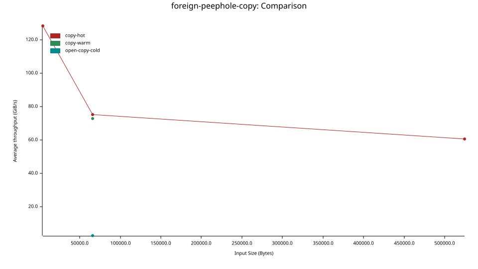
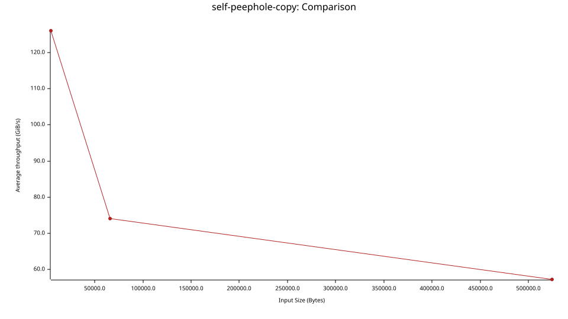

# catalejo

Catalejo observes the memory of another process through the `mirilla` kernel module.

A privileged process engages a target, opens peepholes over ranges of the target's address space, and reads that memory through a local mapping. The reads are machine-word coherent and fault-protected. When the target unmaps or remaps the range the peephole goes dead and the access returns nothing rather than crashing the observer.

This is a work in progress. It runs on Linux and `x86_64`.

## Why it exists

Reading another live process' memory is normally done with `ptrace` or `process_vm_readv`. Both copy bytes across the kernel boundary on every access. A single read is a system call and a memcpy, and observing a region at a high rate means paying that toll again for every word. The observer never sees the target's memory directly. It sees a snapshot the kernel assembled for it a moment ago.

Catalejo removes the copy and the per-read call. Rather than asking the kernel to fetch bytes, it asks `mirilla` to alias the target's physical frames into the observer's own address space. Once a page is aliased, reading it is a plain load instruction against the observer's page table, and that page table points at the very same physical memory the target is using. There is no buffer in between and no call per read. The cost is paid once when a window opens and once more when a page is first touched, and every read after that is a bare, cache-resident load.

Aliasing live memory raises two hazards, and the design answers each one.

The first hazard is tearing. The target keeps running and may mutate a value while it is read. Catalejo does not lock the target, because locking a foreign address space to read it defeats the purpose. Instead it leans on the hardware. A read of a naturally aligned machine word is serviced by the memory subsystem as one indivisible transaction, so the observed value is the exact state before or after a concurrent write and never a hybrid of the two. `catalejo-memory` formalizes this into a coherence model, and only types that are valid for every bit pattern, marked `Unassociated`, may cross a peephole.

The second hazard is disappearance. The target may unmap the range, remap it elsewhere, or exit while the observer holds an alias to it. A stray load against freed memory would fault the observer. Catalejo makes that fault survivable. Every read runs through a naked assembly routine whose faults are caught by a chaining signal handler and reported as an absent read, so a dead peephole yields nothing instead of a crash. The kernel side closes the same gap from below. An MMU notifier registered on the target tears the alias down the instant the target changes its mapping, so the window is marked dead before a torn or stale frame can be observed.

## How a read works

A peephole is a window the kernel opens from the observer onto a frame of the target's address space. A frame is a target address quantized by the granule size, analogous to a page frame number, and it names the granule-sized window an address falls into. Reading through a peephole is three layered costs, each paid lazily and each paid once.

- **Resolution.** An observed address is quantized to its frame and resolved against the observer's window table, a sharded map keyed by frame. The lookup is a shift, a mask, and a map hit, and it is memoized, so a repeated read of the same granule never re-resolves and never calls into the kernel.
- **Opening.** The first read of a fresh frame pays one `ioctl` to register the window and one `mmap` to place it in the observer's address space. A granule spans many pages, so this cost is amortized across every page the window covers. Subsequent reads of that granule reuse the mapping.
- **Fault-in.** The first read of a window page installs its alias. Every later read of that page is resident and faults nothing.

Two addresses in the same window share a frame and reuse a single peephole. Because address space layout randomization places a structure at an arbitrary offset within the granule tiling, a structure can straddle a granule boundary and fall across two windows. A `Rebased` manager therefore keeps a second grid shifted by a half granule, so a straddling access is served whole from the shifted window rather than from two halves.

## How pages are initialized

Opening a peephole does not pin any memory. The `mmap` produces a `VM_MIXEDMAP` VMA with no pages behind it, so the window costs address space and a little bookkeeping rather than resident frames. Pages are installed one at a time, on demand, the first time the observer reads them.

The install happens in the module's page-fault handler.

- The handler turns the faulting page offset back into a target virtual address and rejects the fault early when the peephole is already dead or the address is out of the window's bounds.
- It samples the target's MMU interval notifier so it can detect an invalidation that races the fault before a page is installed.
- It pins the target's page with `get_user_pages_remote` against the target's `mm_struct`. This walks the target's own page tables and faults the target's page in if the target had not touched it yet, so the observer never invents a frame the target does not have. A self-peephole reuses the `mmap_lock` the outer fault already holds, and a foreign peephole takes the target's `mmap_lock` under an `mmget` so the address space cannot be torn down mid-fault.
- Under an install lock it re-checks the interval notifier. If the target invalidated the range while the page was being pinned, the fresh pin is already stale, so the handler drops it and re-faults rather than install a frame the target has moved on from.
- Otherwise it installs the target frame's page number into the observer's page table with `vmf_insert_mixed`. The observer's page-table entry now aliases the target's physical frame, and the transient reference taken to read the frame number is dropped because the entry itself keeps the frame reachable.

After the entry is installed, the observer reads that page as ordinary memory. The load resolves through the resident entry straight into the shared frame, with no fault, no call, and no copy.

Teardown runs from the same notifier. When the target unmaps, remaps, or frees the range, the kernel invokes the interval notifier's invalidate callback, which marks the peephole dead, advances the notifier sequence under the install lock, and zaps the installed aliases. A later fault against a dead peephole returns a bus error, which is exactly the fault `catalejo-fault` catches and reports as an absent read.

## Speed

The layered costs are arranged so that the expensive ones are rare and the common one is trivial. Resolution is a memoized frame lookup with no system call. Opening is one ioctl and one mmap amortized across a whole granule. A fault-in is a single minor page fault that installs a shared frame. A hot read is then a load through a resident entry that aliases the target's frame, so it runs at memory speed rather than syscall speed.

The default granule is a two-megabyte huge frame. A large granule keeps the window table small and amortizes the open across the many pages it covers, and the granule size is a power of two, so quantizing an address to its frame is a single shift. The self_peephole benchmark suite isolates each of these costs by engaging the benchmarking process as its own target, so no second process is needed. It reads a machine word out of a peephole that points back into the reader. A foreign_peephole benchmark exists, but such requires a proper setup to run.

| Benchmark          | Group     | Isolates                                                          |
| ------------------ | --------- | ----------------------------------------------------------------- |
| resolve-only       | resolve   | The memoized window lookup, no read.                              |
| open-cold          | resolve   | A fresh window's ioctl and mmap, no read.                         |
| read-hot           | read      | The fault-protected read alone, over a resident page.             |
| resolve-read-hot   | read      | The whole hot path, a memoized lookup then a resident read.       |
| source-read-warm   | read      | The find-or-open path over an already-open, resident window.      |
| open-read-cold     | read      | A cold open plus the first read that faults the new page in.      |

The read group declares a per-iteration throughput of one machine word, so criterion reports its figures as read speeds in GiB/s alongside the latencies.

Benchmarks were executed on a Ryzen 7 7700X with PBO and EXPO II enabled, utilizing DDR5 6000 MT/s CL30 32 GB RAM (2x16 GB Dual Channel) running 7.1.3-arch2. The performance analysis prioritizes small reads and bulk copies across both self and foreign targets. Note that no measurable difference in speed exists between self and foreign operations.

### Read Performance


### Copy Throughput




### Raw Benchmark Output

```text
running 0 tests

test result: ok. 0 passed; 0 failed; 0 ignored; 0 measured; 0 filtered out; finished in 0.00s

Gnuplot not found, using plotters backend
foreign-peephole-resolve/resolve-only
                        time:   [12.959 ns 12.974 ns 12.990 ns]
Found 3 outliers among 100 measurements (3.00%)
  2 (2.00%) high mild
  1 (1.00%) high severe
foreign-peephole-resolve/open-cold
                        time:   [3.9171 µs 4.0112 µs 4.0937 µs]

foreign-peephole-read/read-hot
                        time:   [4.1060 ns 4.1161 ns 4.1286 ns]
                        thrpt:  [1.8046 GiB/s 1.8101 GiB/s 1.8146 GiB/s]
Found 3 outliers among 100 measurements (3.00%)
  1 (1.00%) high mild
  2 (2.00%) high severe
foreign-peephole-read/resolve-read-hot
                        time:   [15.310 ns 15.344 ns 15.388 ns]
                        thrpt:  [495.82 MiB/s 497.22 MiB/s 498.33 MiB/s]
Found 8 outliers among 100 measurements (8.00%)
  1 (1.00%) low severe
  1 (1.00%) low mild
  6 (6.00%) high severe
foreign-peephole-read/source-read-warm
                        time:   [17.526 ns 17.549 ns 17.571 ns]
                        thrpt:  [434.20 MiB/s 434.76 MiB/s 435.31 MiB/s]
Found 1 outliers among 100 measurements (1.00%)
  1 (1.00%) high mild
foreign-peephole-read/open-read-cold
                        time:   [8.2127 µs 8.2795 µs 8.3570 µs]
                        thrpt:  [934.84 KiB/s 943.60 KiB/s 951.27 KiB/s]

foreign-peephole-copy/copy-hot/4096
                        time:   [29.717 ns 29.747 ns 29.778 ns]
                        thrpt:  [128.10 GiB/s 128.24 GiB/s 128.37 GiB/s]
Found 17 outliers among 100 measurements (17.00%)
  7 (7.00%) low severe
  4 (4.00%) low mild
  4 (4.00%) high mild
  2 (2.00%) high severe
foreign-peephole-copy/copy-hot/65536
                        time:   [811.40 ns 812.60 ns 814.10 ns]
                        thrpt:  [74.972 GiB/s 75.111 GiB/s 75.222 GiB/s]
Found 20 outliers among 100 measurements (20.00%)
  1 (1.00%) low mild
  9 (9.00%) high mild
  10 (10.00%) high severe
foreign-peephole-copy/copy-hot/524288
                        time:   [8.0915 µs 8.1165 µs 8.1409 µs]
                        thrpt:  [59.979 GiB/s 60.159 GiB/s 60.345 GiB/s]
foreign-peephole-copy/copy-warm
                        time:   [836.31 ns 837.57 ns 839.16 ns]
                        thrpt:  [72.733 GiB/s 72.872 GiB/s 72.982 GiB/s]
Found 6 outliers among 100 measurements (6.00%)
  3 (3.00%) high mild
  3 (3.00%) high severe
foreign-peephole-copy/open-copy-cold
                        time:   [22.364 µs 22.489 µs 22.623 µs]
                        thrpt:  [2.6979 GiB/s 2.7140 GiB/s 2.7292 GiB/s]
Found 2 outliers among 100 measurements (2.00%)
  2 (2.00%) high severe

Gnuplot not found, using plotters backend
self-peephole-resolve/resolve-only
                        time:   [12.958 ns 12.981 ns 13.004 ns]
Found 2 outliers among 100 measurements (2.00%)
  1 (1.00%) low mild
  1 (1.00%) high mild
self-peephole-resolve/open-cold
                        time:   [3.4887 µs 3.5514 µs 3.6194 µs]
Found 4 outliers among 100 measurements (4.00%)
  3 (3.00%) high mild
  1 (1.00%) high severe

self-peephole-read/read-hot
                        time:   [4.1164 ns 4.1228 ns 4.1306 ns]
                        thrpt:  [1.8038 GiB/s 1.8072 GiB/s 1.8100 GiB/s]
Found 4 outliers among 100 measurements (4.00%)
  2 (2.00%) high mild
  2 (2.00%) high severe
self-peephole-read/resolve-read-hot
                        time:   [15.360 ns 15.394 ns 15.430 ns]
                        thrpt:  [494.45 MiB/s 495.62 MiB/s 496.71 MiB/s]
Found 3 outliers among 100 measurements (3.00%)
  2 (2.00%) high mild
  1 (1.00%) high severe
self-peephole-read/source-read-warm
                        time:   [17.357 ns 17.378 ns 17.400 ns]
                        thrpt:  [438.47 MiB/s 439.02 MiB/s 439.56 MiB/s]
Found 2 outliers among 100 measurements (2.00%)
  1 (1.00%) low mild
  1 (1.00%) high mild
self-peephole-read/open-read-cold
                        time:   [8.2991 µs 8.3738 µs 8.4517 µs]
                        thrpt:  [924.38 KiB/s 932.97 KiB/s 941.37 KiB/s]
Found 5 outliers among 100 measurements (5.00%)
  5 (5.00%) high mild

self-peephole-copy/4096 time:   [30.185 ns 30.289 ns 30.402 ns]
                        thrpt:  [125.47 GiB/s 125.94 GiB/s 126.38 GiB/s]
Found 5 outliers among 100 measurements (5.00%)
  3 (3.00%) high mild
  2 (2.00%) high severe
self-peephole-copy/65536
                        time:   [816.23 ns 817.83 ns 819.87 ns]
                        thrpt:  [74.445 GiB/s 74.631 GiB/s 74.777 GiB/s]
Found 8 outliers among 100 measurements (8.00%)
  2 (2.00%) high mild
  6 (6.00%) high severe
self-peephole-copy/524288
                        time:   [8.3507 µs 8.3866 µs 8.4308 µs]
                        thrpt:  [57.916 GiB/s 58.221 GiB/s 58.472 GiB/s]
```

## Building

Build the workspace with Cargo and the module with the kernel build system.

```sh
cargo build --workspace
make -C mirilla module
```

## Testing

The suites read a live `/dev/mirilla`, so they run inside a [`virtme-ng`](https://github.com/arighi/virtme-ng) VM that boots a mirilla-powered kernel. Every task is a [`just`](https://just.systems) recipe, and `just --list` shows them grouped by sub-module.

```sh
just lint              # rustfmt + clippy, and clang-format + clangd
just mirilla-test-vm   # build the module and run the C test suite in a VM
just catalejo-test-vm  # build the module and run the Rust test suite in a VM
```

The `*-vm` recipes are host-side, and build what the guest needs before launching the VM against the kernel tree named by `KDIR` (defaulting to the running kernel's build directory). The plain `mirilla-test`, `catalejo-test` recipes are the guest-side halves, run as root inside the VM against a loaded module.

## Continuous integration

Five jobs run on every push and pull request.

- **Automated Linting (Rust)** runs `cargo fmt` and `clippy`.
- **Automated Linting (C)** runs `clang-format` and `clangd`.
- **Mirilla-powered Kernel Test Suite** runs the C suite, once per kernel series.
- **Mirilla-powered Kernel Integration Tests** runs the Rust test suite, once per kernel series.

The mirilla-powered jobs run against the latest longterm and latest stable kernel series.

## License

GPL-3.0-or-later. See the LICENSE file.
